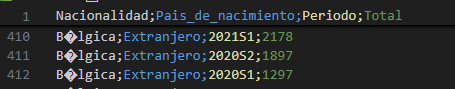

El objetivo de esta prueba es conseguir una visualización gráfica de los movimientos migratorias de España en el año 2021.

```{r}
if (!require(devtools)) {
  install.packages("devtools")
  library(devtools)
}

```

```{r}
devtools::install_github("ChristopherLucas/translateR")

```

```{r}
# Supresión de advertencias
options(warn = -1)
suppressPackageStartupMessages({

  # Lista de paquetes
  paquetes <- c("dplyr", "quantmod", "zoo", "tidyr", "reshape2", "scales", "text", 
                "reticulate", "ggplot2", "sf", "geosphere", "forecast","countrycode","rnaturalearth","rnaturalearthdata","ggrepel","googleLanguageR")

  # Verificar e instalar paquetes si no están presentes
  for (pkg in paquetes) {
    if (!require(pkg, character.only = TRUE)) {
      install.packages(pkg, dependencies = TRUE)
      library(pkg, character.only = TRUE)
    }
  }

  # Instalar y cargar translateR desde GitHub si no está instalado
  if (!require(translateR)) {
    devtools::install_github("ChristopherLucas/translateR")
    library(translateR)
  }
})

```

```{r}
options(warn = -1)
suppressPackageStartupMessages({
  library(dplyr)
  library(quantmod)
  library(zoo)
  library(tidyr)
  library(reshape2)
  library(scales)
  library(text)
  library(reticulate)
  library(ggplot2)
  library(sf)
  library(geosphere)
  library(forecast)
  library(translateR)
  library(googleLanguageR)
  library(countrycode)
  library(rnaturalearth)
  library(sf)
  library(rnaturalearthdata)
  library(ggrepel)
})

```

```{r}
df = read.csv("dfIne.csv", sep = ";", header = TRUE, fileEncoding = "latin1")
head(df)
```

primero debemos hacer un análisis exploratorio sobre lo que queremos sacar del dataframe y tras hacer alguna exploración tanto visual como usando r. Vemos que solo nos interesan las lineas que tengan el siguiente formato:



Es decir, que la nacionalidad sea un país, y que el país de nacimiento sea 'Extranjero'. luego vemos que tenemos los años separados por semestre. lo cual nos tocara juntar ambos semestres en un único año.

Para ello buscamos los valores unicos de 'Nacionalidad' para ver cuantos valores de paises tenemos y empezar a limpiar por ahí

```{r}
unique(df$Nacionalidad)
```

vemos que en el dataset se contempla agrupaciones de países que no nos interesan por lo que deberemos quitarlos del dataset. Y ademas podemos aprovechar para filtrar por el año directamente para solo quedarnos con 2021

```{r}
df <- df %>%
  filter(
    Pais_de_nacimiento == "Extranjero" &
      !Nacionalidad %in% c(
        'Total', 
        'País de la UE27_2020 sin España', 
        'País de la UE28 sin España', 
        'Otro país de la Unión Europea sin España', 
        'País de Europa menos UE27_2020', 
        'País de Europa menos UE28', 
        'Otro país del resto de Europa', 
        'Otro país de África', 
        'De América del Norte', 
        'De Centro América y Caribe', 
        'Otro país de Centro América y Caribe', 
        'Otro país de Sudamérica', 
        'Otro país de Asia', 
        'De Oceanía', 
        'Apátridas', 
        "De Africa", 
        "De Asia", 
        "De Sudamérica"
      )&
      Periodo %in% c("2021S1", "2021S2")
  )
df
```

Vamos a juntar los dos semestres del año en un único valor.

```{r}
df_2021 <- df %>%
  mutate(Año = substr(Periodo, 1, 4)) %>% 
  group_by(Nacionalidad, Pais_de_nacimiento, Año) %>%
  summarise(Total = sum(Total, na.rm = TRUE), .groups = 'drop') 

head(df_2021)
```

Cambiamos el idioma de español a ingles (LA AUTENTIFICACION ESTA BORRADA, NO FUNCIONA. para llegar a conectarla hay que ir a google cloud, IAM y administración, cuenta de servicio, agregar clave)

```{r}

gl_auth("inemigraciones-2803207280de.json")  


df_2021$Nacionalidad_ingles <- sapply(df_2021$Nacionalidad, function(x) {
  gl_translate(x, target = "en")$translatedText
})

df_2021

```

hacemos un poco de limpieza para dejar el dataset solo con las columnas de nacionalidad y año

```{r}
df_2021 <- df_2021 %>%
  select(-Nacionalidad) %>%                      
  rename(Nacionalidad = Nacionalidad_ingles) %>% 
  select(Nacionalidad, everything())             
```

```{r}
df_2021$Pais_de_nacimiento <- NULL
df_2021$Año <- NULL
df_2021 <- df_2021 %>%
  rename(Migraciones_2021 = Total)

head(df_2021)
```

En pruebas anteriores nos hemos fijado que en la traducción hay errores en algunos países. buscamos que países no contempla countrycode y los arreglamos manualmente para que los detecte y no de nulos.

```{r}
# Aplicar countrycode y ver qué valores se convierten en NA
df_2021$Nacionalidad_codificada <- countrycode(df_2021$Nacionalidad, origin = "country.name", destination = "country.name")

# Verificar los nombres que se convirtieron en NA
nombres_no_encontrados <- df_2021 %>%
  filter(is.na(Nacionalidad_codificada)) %>%
  select(Nacionalidad)

nombres_no_encontrados

```

viendo que esos paises no estan correctamente traducidos los cambiamos al nombre correcto. caso especial con `they had` tras comparar ambos datasets nos hemos fijado que Mali desaparece

```{r}
# Reemplazar manualmente los nombres de países para que coincidan con los estándares de countrycode
df_2021$Nacionalidad <- recode(df_2021$Nacionalidad,
                               "Spanish" = "Spain",
                               "Filipinas" = "Philippines",
                               "They had" = "Mali",  
                               "Moldavia" = "Moldova")

df_2021$Nacionalidad_codificada <- NULL


df_2021

```

Conseguimos la latitud y la longitud de los países usando librerías de r como rnaturalearth entre otras

```{r}
# Convertir los nombres a un formato estándar para asegurarse de que coincidan
df_2021$Nacionalidad <- countrycode(df_2021$Nacionalidad, origin = "country.name", destination = "country.name")

# Obtener los datos de países con la columna `geometry`
countries <- rnaturalearth::ne_countries(scale = "medium", returnclass = "sf") %>%
  select(name, geometry)

# Calcular los centroides de los países y extraer latitud y longitud
countries <- countries %>%
  mutate(centroid = st_centroid(geometry)) %>%                   # Calcular el centroide
  mutate(latitude = st_coordinates(centroid)[, 2],               # Extraer latitud
         longitude = st_coordinates(centroid)[, 1]) %>%          # Extraer longitud
  select(name, latitude, longitude)                              # Seleccionar solo las columnas necesarias

# Unir el dataframe `df_2021` con los datos de coordenadas, evitando duplicados
df_2021 <- df_2021 %>%
  left_join(countries, by = c("Nacionalidad" = "name"))


df_2021$geometry <- NULL
# Verificar el resultado
head(df_2021)

```

Tras añadir las longitudes y latitudes, y verificar el df algunas no se han añadido asi que las ponemos.

```{r}
df_2021 <- df_2021 %>%
  mutate(latitude = ifelse(Nacionalidad == "Dominican Republic" & is.na(latitude), 18.7357, latitude),
         longitude = ifelse(Nacionalidad == "Dominican Republic" & is.na(longitude), -70.1627, longitude),
         latitude = ifelse(Nacionalidad == "Equatorial Guinea" & is.na(latitude), 1.6508, latitude),
         longitude = ifelse(Nacionalidad == "Equatorial Guinea" & is.na(longitude), 10.2679, longitude),
         latitude = ifelse(Nacionalidad == "United States" & is.na(latitude), 37.0902, latitude),
         longitude = ifelse(Nacionalidad == "United States" & is.na(longitude), -95.7129, longitude))

df_2021
```

## Preparación mapamundi

### crear las lineas de conexión

```{r}
# Coordenadas de España
origen_lon <- -3.7492
origen_lat <- 40.4637

# Generar las líneas de conexión desde España a cada país
lineas <- df_2021 %>%
  rowwise() %>%
  mutate(geometry = list(st_linestring(gcIntermediate(c(origen_lon, origen_lat), 
                                                      c(longitude, latitude), 
                                                      n = 100, addStartEnd = TRUE))))

```

### Cargar el mapamundi

```{r}
# Cargar el mapa del mundo en formato `sf`
world <- ne_countries(scale = "medium", returnclass = "sf")

```

### Graficamos con ggplot2

```{r}
# Crear el gráfico
ggplot(data = world) +
  geom_sf(fill = "gray80", color = "white") +  # Mapa base en gris claro
  geom_sf(data = lineas, aes(geometry = geometry, color = Migraciones_2021), size = 0.7, alpha = 0.7) +  # Líneas de conexión
  geom_point(data = df_2021, aes(x = longitude, y = latitude, size = Migraciones_2021, color = Migraciones_2021), alpha = 0.8) +  # Puntos de destino
  scale_color_viridis_c(option = "plasma", trans = "sqrt") +  # Escala de color para las líneas y puntos
  labs(title = "Migraciones desde España hacia el resto del mundo",
       x = NULL, y = NULL) +
  theme_minimal() +
  theme(panel.background = element_rect(fill = "aliceblue"),
        legend.position = "bottom",
        legend.title = element_blank(),
        axis.text = element_blank(),
        axis.ticks = element_blank())

```

No queremos este mapa, solo el de Europa pero es extra\
Solo de Europa.

```{r}
df_2021_europe <- df_2021 %>%
  mutate(continente = countrycode(Nacionalidad, origin = "country.name", destination = "continent")) %>%
  filter(continente == "Europe")

```

### Creamos las lineas de conexión y Europa

```{r}
# Coordenadas de España
origen_lon <- -3.7492
origen_lat <- 40.4637

# Generar las líneas de conexión desde España a cada país en Europa
lineas <- df_2021_europe %>%
  rowwise() %>%
  mutate(geometry = list(st_linestring(gcIntermediate(c(origen_lon, origen_lat), 
                                                      c(longitude, latitude), 
                                                      n = 100, addStartEnd = TRUE)))) %>%
  st_as_sf(crs = 4326)  # Convertir a formato `sf` para graficar
# Cargar el mapa del mundo y luego filtrarlo solo para Europa
world <- ne_countries(scale = "medium", returnclass = "sf") %>%
  filter(region_un == "Europe")
```

### Creamos el gráfico

```{r}
ggplot(data = world_europe) +
  geom_sf(fill = "gray80", color = "white") +  # Mapa base en gris claro
  geom_sf(data = lineas_europe, aes(geometry = geometry, color = Migraciones_2021), size = 0.7, alpha = 0.7) +  # Líneas de conexión
  geom_point(data = df_2021_europe, aes(x = longitude, y = latitude, size = Migraciones_2021, color = Migraciones_2021), alpha = 0.8) +  # Puntos de destino
  geom_text_repel(data = df_2021_europe, aes(x = longitude, y = latitude, 
                                             label = paste(Nacionalidad, Migraciones_2021, sep = "\n")), 
                  size = 3, color = "black") +  # Etiquetas con el nombre del país y el número de migrantes
  scale_color_viridis_c(option = "plasma", trans = "sqrt") +  # Escala de color para las líneas y puntos
  labs(title = "Migraciones desde España hacia Europa",
       x = NULL, y = NULL) +
  coord_sf(xlim = c(-25, 45), ylim = c(34, 72), expand = FALSE) +  # Zoom en Europa
  theme_minimal() +
  theme(panel.background = element_rect(fill = "aliceblue"),
        legend.position = "none",  # Eliminar todas las leyendas
        axis.text = element_blank(),
        axis.ticks = element_blank())

```

Corregimos las coordenadas de Francia y quitamos a el número en España

```{r}
df_2021_europe <- df_2021_europe %>%
  mutate(
    latitude = ifelse(Nacionalidad == "France", 46.603354, latitude),
    longitude = ifelse(Nacionalidad == "France", 1.888334, longitude)
  )

```

```{r}
#write.csv(df_2021_europe, "df_2021_europe_limpio.csv", row.names = FALSE)
#write.csv(df_2021, "df_2021_limpio.csv", row.names = FALSE)
```

```{r}
# Coordenadas de España
origen_lon <- -3.7492
origen_lat <- 40.4637

# Generar las líneas de conexión desde España a cada país en Europa usando las coordenadas actualizadas
lineas_europe <- df_2021_europe %>%
  rowwise() %>%
  mutate(geometry = list(st_linestring(gcIntermediate(c(origen_lon, origen_lat), 
                                                      c(longitude, latitude), 
                                                      n = 100, addStartEnd = TRUE)))) %>%
  st_as_sf(crs = 4326)  # Convertir a formato `sf` para graficar

# Crear el gráfico con zoom en Europa y etiquetas
ggplot(data = world_europe) +
  geom_sf(fill = "gray80", color = "white") +  # Mapa base en gris claro
  geom_sf(data = lineas_europe, aes(geometry = geometry, color = Migraciones_2021), size = 0.7, alpha = 0.7) +  # Líneas de conexión
  geom_point(data = df_2021_europe, aes(x = longitude, y = latitude, size = Migraciones_2021, color = Migraciones_2021), alpha = 0.8) +  # Puntos de destino
  geom_text_repel(data = df_2021_europe %>% filter(Nacionalidad != "Spain"),  # Excluir España
                  aes(x = longitude, y = latitude, 
                      label = paste(Nacionalidad, Migraciones_2021, sep = "\n")), 
                  size = 3, color = "black") +  # Etiquetas con el nombre del país y el número de migrantes
  scale_color_viridis_c(option = "plasma", trans = "sqrt") +  # Escala de color para las líneas y puntos
  labs(title = "Migraciones desde España hacia Europa",
       x = NULL, y = NULL) +
  coord_sf(xlim = c(-25, 45), ylim = c(34, 72), expand = FALSE) +  # Zoom en Europa
  theme_minimal() +
  theme(panel.background = element_rect(fill = "aliceblue"),
        legend.position = "none",  # Eliminar todas las leyendas
        axis.text = element_blank(),
        axis.ticks = element_blank())


```
